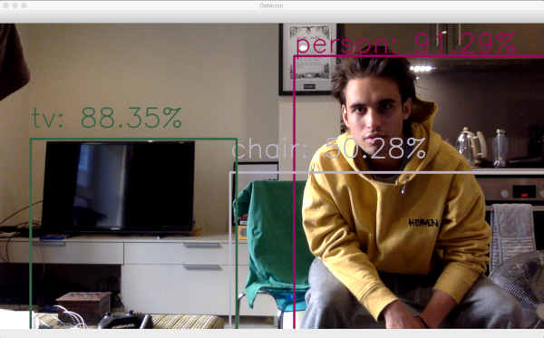

## Live object detection using MobileNetSSD
This script uses OpenCV's DNN library to load weights from a MobileNet SSD tensorflow model.
The classes available are from the COCO dataset. 
The efficient [imutils](https://github.com/jrosebr1/imutils) is used for camera interfacing. 


### Setup
The code was developped using a python virtualenv
To get started use the following commands:
```
pip install --upgrade pip
git clone git@github.com:mm5631/live_object_detection.git
cd live_object_detection
python3 -m venv .env
source .env/bin/activate
pip install -r requirements.txt
```

### Execution
To run the script, simply execute ```$ python src/detect.py```.
Press "q" to exit the process.

### Example

